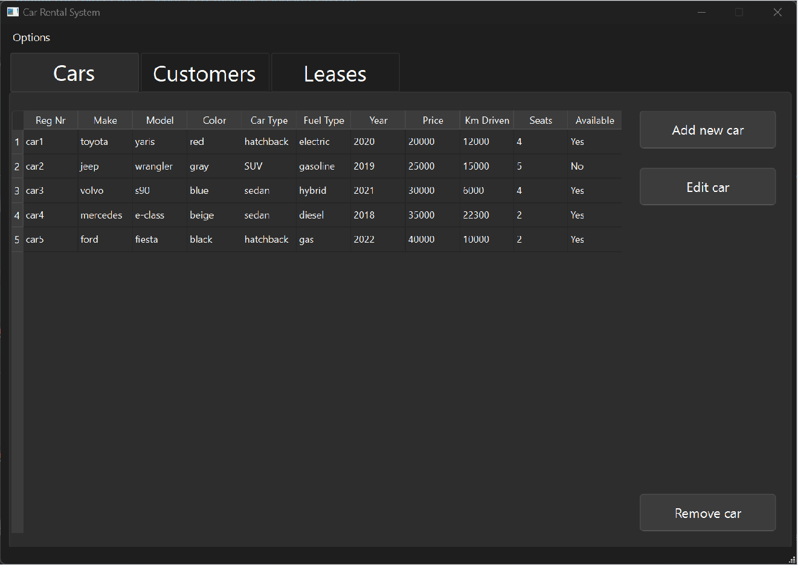

# Welcome To RustyRides
This is the group project for the IKT103 exam. We chose the Car rental GUI exam project.

# Table of Contents
- [Dependencies](#dependencies)
- [How to build](#how-to-build-the-project)
- [Assignment Description](#assignment-description)
- [Technologies Used](#technologies-used)
- [Group](#group)

# Dependencies
- [Qt Library](https://wiki.qt.io/Main)
- [RapidJson](https://github.com/Tencent/rapidjson)

# How to build the project
If you want to try out the project, you can build it yourself by opening the CMakeLists.txt file in QtCreator or from the command line.

### Building with QtCreator
1. Open QtCreator.
2. Open the project by selecting the CMakeLists.txt file.
3. Configure the project and build it.

### Building from the Command Line
1. Navigate to the project directory.
2. Run the following commands:
   ```sh
   mkdir build
   cd build
   cmake ..
   make
   ```
The database might not load, but that is no problem since you can import and export with the top left button in our GUI.

# Assignment Description
The assignment was for the IKT103 subject at UiA where we were tasked with making a managing system for a fictional car rental company.

We tried making the code as readable as possible where many of the functions where written with doxygen comments, which we ended up not using because of time constraints.
## GUI In Action

# Technologies Used
### Qt Framework
The program was built with the Qt-framework and we used the Qt-designer extensively to design our GUI.
### RapidJson Library
This is the library we used to store, access and edit database related entries with a DOM-approach. The code for json-parsing is all contained in a json-parser class; [header-file](include/JsonParser.h), [cpp-file](src/JsonParser.cpp)

# Group
### Group Members:
- Albert Salvesen-Orø
- Marcus Hagen